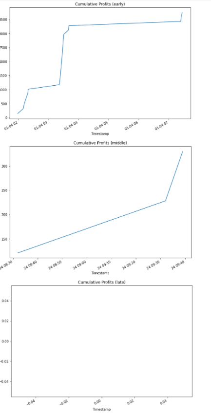

# Crypto Arbitrage

This analysis is to determine if arbitrage opportunities were available trading bitcoin between two crypto currency exchanges (Bitstamp and Coinbase) during the first three months of 2018 (Jan 1, 2018 - March 31, 2018).

---

## Technologies

This analysis uses Python in Jupyter Lab with the following packages:

- [Pandas](https://pandas.pydata.org/) to analyze and manipulate data
- [Path](https://docs.python.org/3.7/library/pathlib.html) from pathlib library to download trading data from another file
- [%matplotlib inline](https://matplotlib.org/) in order to see visual output in notebook 

---

## Process

The trading data for the two exchanges were cleaned to focus only on bitcoin prices for three individual days. One day was early in the data set, one in the middle and one late:

Focusing in on the three individual days, we were able to determine how many profitable trading opportunities existed (in addition to other statistics) where a trader could buy on the lower priced exchange and sell on the higher priced exchange while still profiting net of trading fees (1%). 

The analysis shows that as time progressed, not only did profits per trade decline, but opportunities for profit declined as well.

---

## Contributors

This project was created by Matt Wojichowski with the guidance of the University of Washington 2021-2022 FinTech Bootcamp Class.

[Matt Wojichowski LinkedIn](https://www.linkedin.com/in/matt-wojichowski-cfa-caia-93a34a42/)

---

## License 

MIT